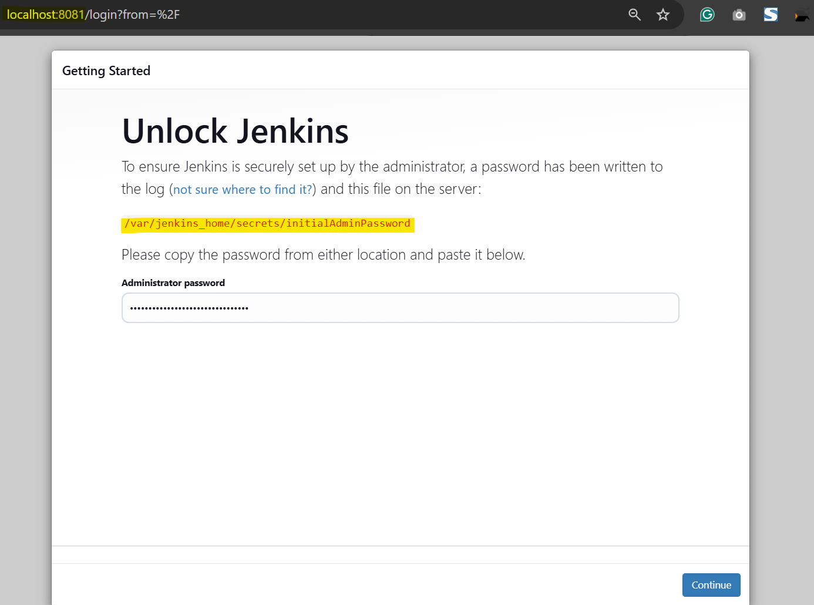
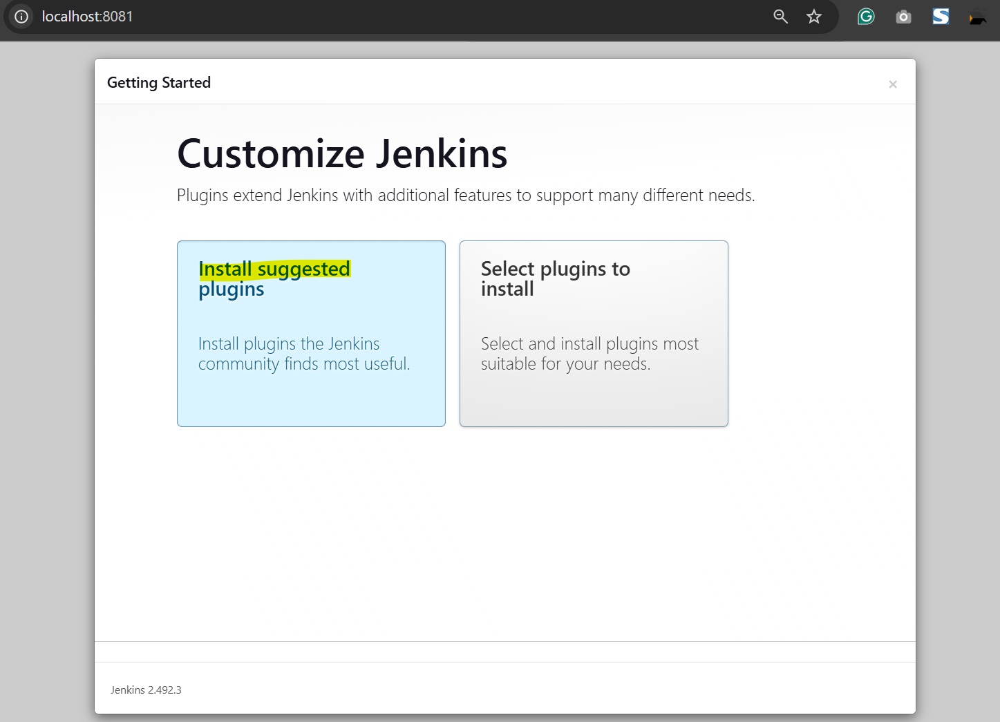
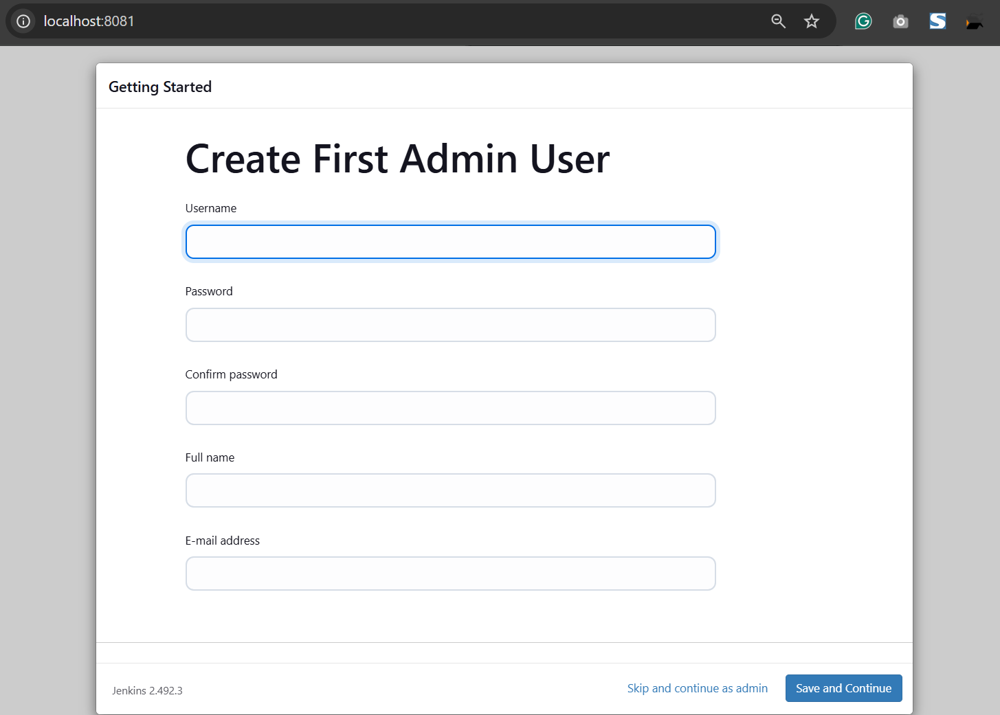
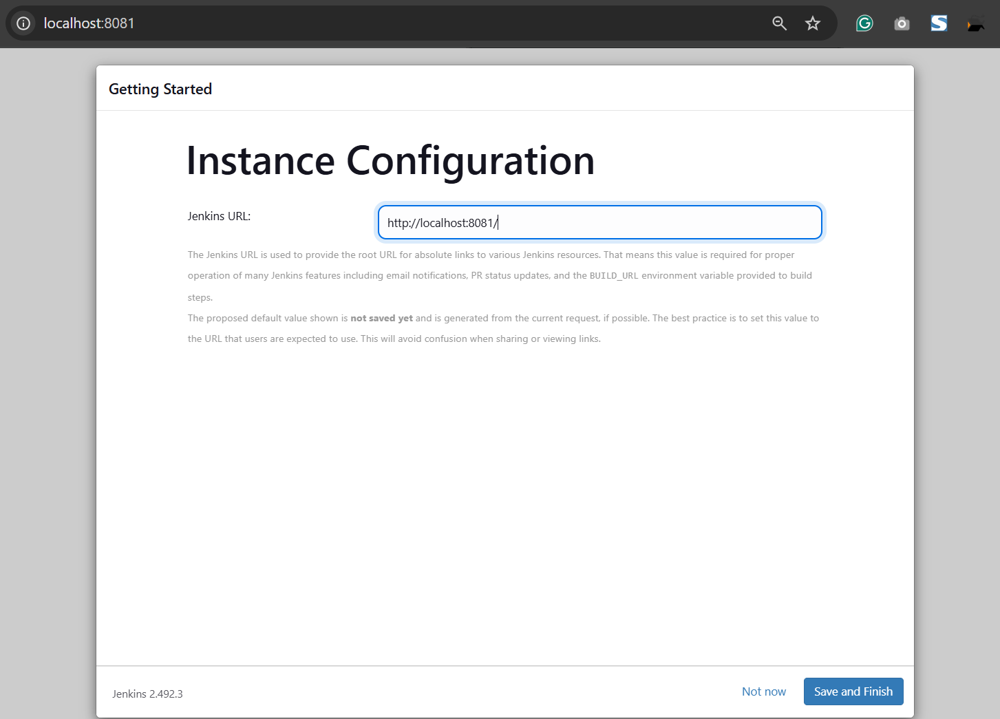
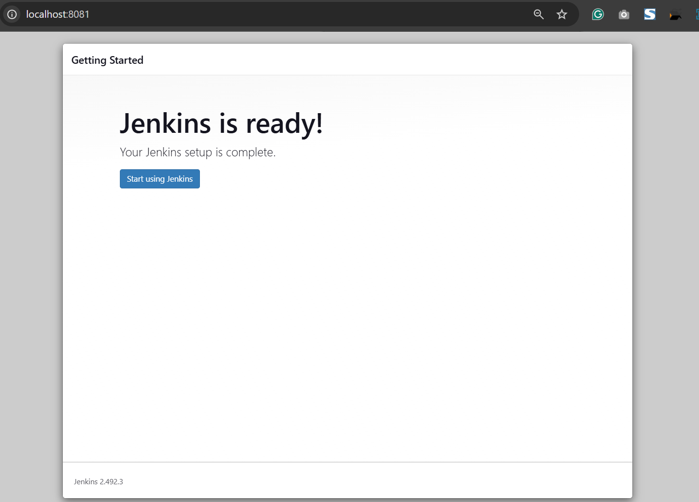
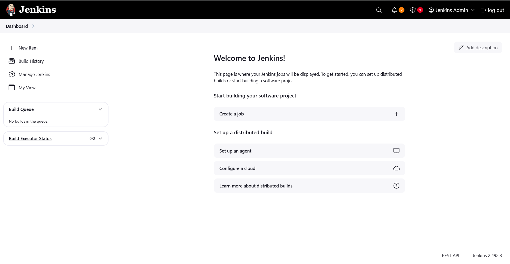

# Jenkins - Install: Docker

[Back](../README.md)

- [Jenkins - Install: Docker](#jenkins---install-docker)
  - [Docker: On Windows](#docker-on-windows)
  - [Configure Jenkins](#configure-jenkins)

## Docker: On Windows

- ref: https://www.jenkins.io/doc/book/installing/docker/#on-windows

---

- Customize the official Jenkins Docker image

```dockerfile
FROM jenkins/jenkins:2.492.3-jdk17
USER root
RUN apt-get update && apt-get install -y lsb-release
RUN curl -fsSLo /usr/share/keyrings/docker-archive-keyring.asc \
  https://download.docker.com/linux/debian/gpg
RUN echo "deb [arch=$(dpkg --print-architecture) \
  signed-by=/usr/share/keyrings/docker-archive-keyring.asc] \
  https://download.docker.com/linux/debian \
  $(lsb_release -cs) stable" > /etc/apt/sources.list.d/docker.list
RUN apt-get update && apt-get install -y docker-ce-cli
USER jenkins
RUN jenkins-plugin-cli --plugins "blueocean docker-workflow"
```

- Build a new docker image

```sh
docker build -t myjenkins-blueocean:2.492.3-1 .
```

- Run your own myjenkins-blueocean:2.492.3-1 image as a container in Docker

```sh
docker network create jenkins

docker run --name jenkins-docker --rm -d --network jenkins  ^
    -e DOCKER_HOST=tcp://docker:2376            ^
    -e DOCKER_CERT_PATH=/certs/client           ^
    -e DOCKER_TLS_VERIFY=1                      ^
    -v jenkins-data:/var/jenkins_home           ^
    -v jenkins-docker-certs:/certs/client:ro    ^
    -p 8081:8080                                ^
    -p 50000:50000                              ^
    myjenkins-blueocean:2.492.3-1
```

---

## Configure Jenkins

```sh
docker exec -it jenkins-docker cat /var/jenkins_home/secrets/initialAdminPassword
```












