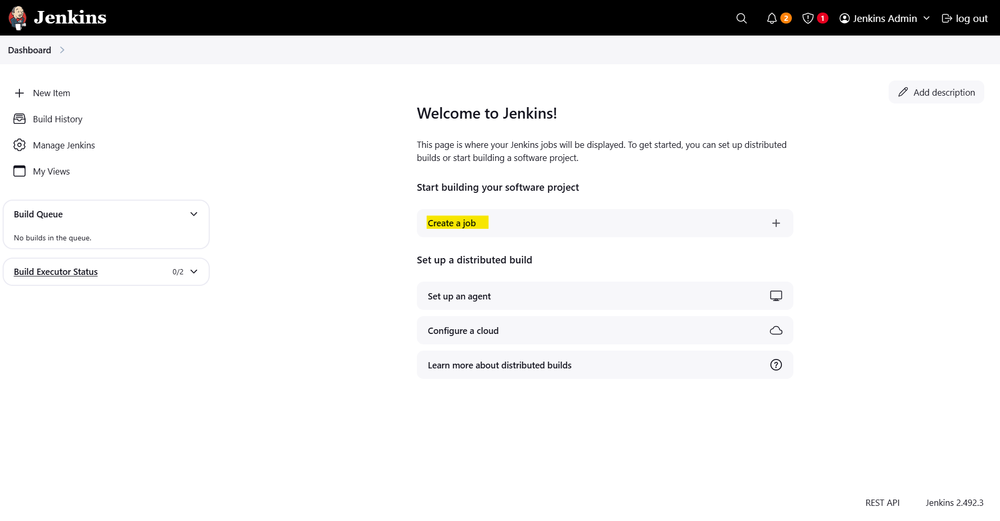
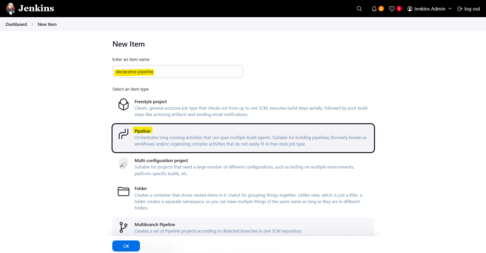
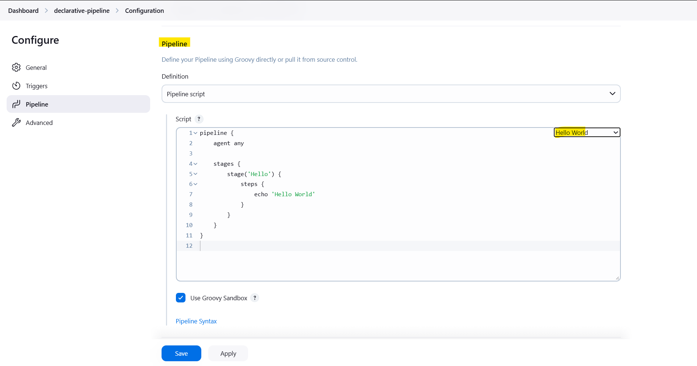
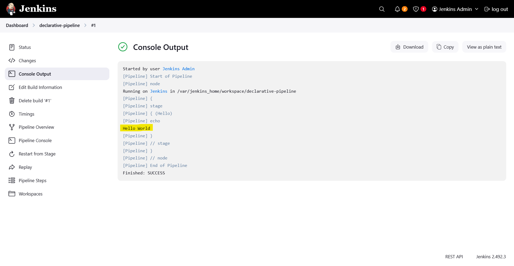
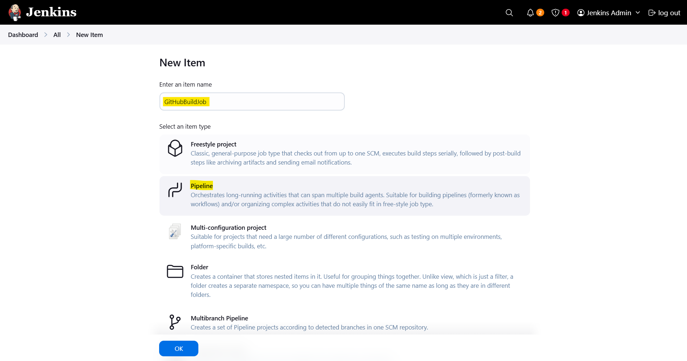

# Jenkins - Pipeline

[Back](../README.md)

- [Jenkins - Pipeline](#jenkins---pipeline)
  - [Create Pipeline](#create-pipeline)
  - [Build Pipeline from SCM](#build-pipeline-from-scm)
    - [Create Jenkinsfile](#create-jenkinsfile)
    - [Create Pipeline](#create-pipeline-1)

---

## Create Pipeline

- Create Pipeline Job





- Configure>Pipeline
  - Declarative



```groovy
pipeline {
    agent any
    stages {
        stage('Stage 1') {
            steps {
                echo 'Hello world!'
            }
        }
    }
}
```

- Save
- Build Now




---

## Build Pipeline from SCM

### Create Jenkinsfile

```groovy
pipeline {
    agent any
    stages {
        stage('build'){
            steps {
                sh 'echo Hello World'
                echo "Build number is ${currentBuild.number}"
            }
        }
    }
}
```

- Commit and push to remote

---

### Create Pipeline


