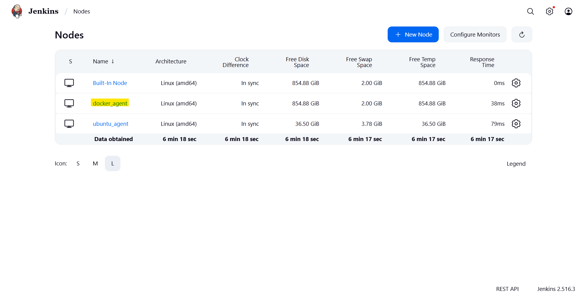

# Jenkins - Agent

[Back](../README.md)

- [Jenkins - Agent](#jenkins---agent)
  - [VM agent](#vm-agent)
    - [Set up Agent Node (Ubuntu)](#set-up-agent-node-ubuntu)
    - [Configure SSH Credential](#configure-ssh-credential)
    - [Configure Agent](#configure-agent)
    - [Jenkins Dashboard](#jenkins-dashboard)
  - [Docker Agent](#docker-agent)
    - [Configure SSH Credential](#configure-ssh-credential-1)
    - [Set up Docker Agent (Ubuntu)](#set-up-docker-agent-ubuntu)
    - [Configure Agent](#configure-agent-1)
    - [Jenkins Dashboard](#jenkins-dashboard-1)

---

## VM agent

### Set up Agent Node (Ubuntu)

```sh
sudo apt update
sudo apt install -y openjdk-17-jre openssh-server git
java --version

# Create jenkins user
sudo useradd jenkins -d /home/jenkins -m -s /bin/bash
sudo mkdir -pv /home/jenkins/agent && sudo chown -Rv jenkins:jenkins /home/jenkins
# set pwd
echo "jenkins:SecurePassword1234" | sudo chpasswd

# create ssh dir
sudo mkdir -pv /home/jenkins/.ssh
sudo touch /home/jenkins/.ssh/authorized_keys
sudo chown jenkins:jenkins -vR /home/jenkins/.ssh
sudo chmod -v 700 /home/jenkins/.ssh
sudo chmod -v 660 /home/jenkins/.ssh/authorized_keys
```

---

### Configure SSH Credential

- Create keys and copy to Agent node

```sh
# linux copy key to linux
ssh-keygen  # default id_ed25519
ssh-copy-id jenkins@on-prem

# Windows compy key to linux: powershell
# cd to user dir
type ".ssh\id_ed25519.pub" | ssh jenkins@on-prem "cat >> .ssh/authorized_keys"

# confirm
ssh jenkins@on-prem
```

---

### Configure Agent

- Install ssh agent plugin
- Configuration for agent node and credential

```yaml
jenkins:
  nodes:
    - permanent:
        labelString: "ubuntu_agent"
        launcher:
          ssh:
            credentialsId: "jenkins_ssh"
            host: "192.168.100.110"
            port: 22
            sshHostKeyVerificationStrategy:
              manuallyTrustedKeyVerificationStrategy:
                requireInitialManualTrust: false
        name: "ubuntu_agent"
        numExecutors: 2
        remoteFS: "/home/jenkins/agent"
        retentionStrategy: "always"
  numExecutors: 0

credentials:
  system:
    domainCredentials:
      - credentials:
          - basicSSHUserPrivateKey:
              description: "ssh credential with agent"
              id: "jenkins_ssh"
              privateKeySource:
                directEntry:
                  privateKey: ${SSH_PRIVATE_KEY}
              scope: GLOBAL
              username: "jenkins"
              usernameSecret: true
```

---

### Jenkins Dashboard

- Input Private Key


- Launch the agent node


- Run pipeline


---

## Docker Agent

### Configure SSH Credential

- Same as above
  - JENKINS_AGENT_SSH_PUBKEY = .pub file content

---

### Set up Docker Agent (Ubuntu)

```yaml
services:
  jenkins-agent:
    container_name: jenkins-agent
    image: jenkins/ssh-agent:jdk21
    restart: unless-stopped
    environment:
      - JENKINS_AGENT_SSH_PUBKEY=${JENKINS_AGENT_SSH_PUBKEY}
    networks:
      - jenkins
    ports:
      - "22:22"
```

---

### Configure Agent

- Install ssh agent plugin
- Configuration for docker agent

```yaml
jenkins:
  nodes:
    - permanent:
        labelString: "ubuntu_agent"
        launcher:
          ssh:
            credentialsId: "jenkins_ssh"
            host: "192.168.100.110"
            port: 22
            sshHostKeyVerificationStrategy:
              manuallyTrustedKeyVerificationStrategy:
                requireInitialManualTrust: false
        name: "ubuntu_agent"
        numExecutors: 2
        remoteFS: "/home/jenkins/agent"
        retentionStrategy: "always"
  numExecutors: 0

jobs:
  - script: >
      pipelineJob('test_docker_agent') {
        definition {
          cpsScm {
            scm {
              git {
                remote {
                  url('https://github.com/simonangel-fong/Tutorial-Jenkins.git')
                }
                branch('*/master')
              }
            }
            scriptPath('module_agent/docker_agent.Jenkinsfile')
          }
        }
      }
```

---

### Jenkins Dashboard

- Launch the agent node




- Run pipeline


